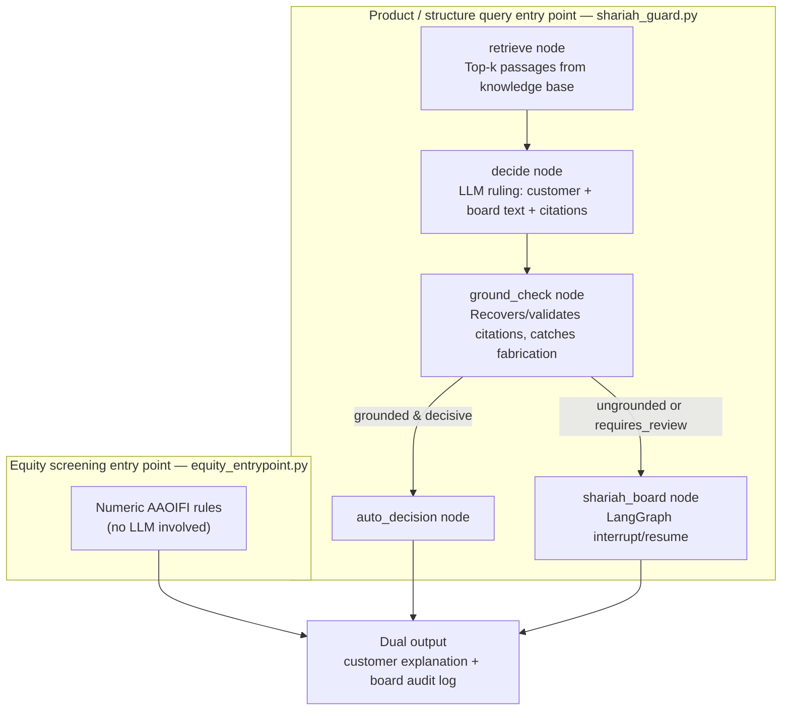

# Shariah Guard

A compliance layer for AI-native financial products: every AI output that touches a
Shari'ah decision is grounded, auditable, and escalates to a human board instead of
improvising — because a single hallucinated ruling costs the exact trust an
AI-native Islamic bank is built on.

## The core idea

Not all Shari'ah questions are the same shape, so this isn't one pipeline — it's
two entry points sharing one principle: **every decision is emitted twice**, once
as a plain customer explanation and once as a full board-facing audit record.

| Question type | Entry point | How it decides |
|---|---|---|
| "Is this product/transaction structure compliant?" (e.g. a Mudarabah, a loan) | `shariah_guard.run(query)` | Retrieval + LLM ruling, gated by a **grounded-citation rule** |
| "Can we invest in this stock?" (AAOIFI equity screening) | `equity_entrypoint.screen_equity_investment(...)` | Deterministic arithmetic — no LLM, no hallucination risk to guard against |

## System design



The two entry points never merge — they only share the same output contract.
Equity screening skips the grounding gate entirely because there's no LLM output
to distrust in that path. The query path always passes through `ground_check`,
which either lets a decision auto-finalize or forces it to a real, checkpointed
pause at `shariah_board` — not a poll loop — before either path reaches the same
dual-output record.

### The grounded-citation rule

An LLM asked to cite its sources will sometimes cite one that was never actually
retrieved. `citation_guard.py` enforces this mechanically, not just via prompting:
the only valid citation numbers for a decision are the passages that were actually
shown to the model for that query. Anything else — or an empty citation list on a
decision that should have one — is treated as **not grounded**, and a non-grounded
decision cannot be auto-emitted; it must escalate to a human Shari'ah board
reviewer (`shariah_board` node, a real `LangGraph` interrupt/resume, not a
polling loop).

### AAOIFI equity screening

`aaoifi_screening.py` implements the two published, numeric AAOIFI thresholds
(Shari'ah Standard No. 21):
- Impermissible (interest/non-compliant) income must be **< 5%** of revenue
- Interest-bearing debt must be **< 30%** of market cap

A stock can pass both and still owe **purification** — the proportional
impermissible-income share of any dividend received, which must be donated. This
path is deliberately kept separate from the LLM pipeline: there's no judgment
call here, and forcing arithmetic through a citation-grounding check built for
LLM output would be solving a problem that can't occur in this path.

## Project layout

```
shariah-guard/
├── aaoifi_screening.py       # numeric screen + purification calculator
├── citation_guard.py         # the grounded-citation rule
├── dual_output.py            # customer + board record assembly (LLM path)
├── equity_entrypoint.py      # customer + board record assembly (deterministic path)
├── shariah_guard.py          # full graph: retrieve -> LLM ruling -> ground-check -> escalate/finalize
└── test_*.py                 # 30 tests, all of which need zero API key
```

## Setup

```bash
python -m venv .venv
source .venv/bin/activate
pip install langgraph langchain-google-genai langchain-huggingface langchain-chroma sentence-transformers pytest requests
```

`shariah_guard.py` reuses the knowledge base already built in a sibling
`sharia-law-rag/` project (`../sharia-law-rag/chroma_db`) — run that project's
ingestion step first if you're setting this up standalone.

Set your model key (only needed for `shariah_guard.py` — `equity_entrypoint.py`
needs nothing):

```bash
export GEMINI_API_KEY=your-key-here
```

## Running it

```bash
# Deterministic equity screen — no API key needed
python equity_entrypoint.py

# Full LLM + retrieval + escalation graph
python shariah_guard.py

# All 30 tests — none need an API key
pytest -v
```

## Design notes

- **Code handles what's enumerable, the LLM handles what's genuinely qualitative.**
  AAOIFI's numeric thresholds are arithmetic — putting them through an LLM adds
  hallucination risk to a calculation. The LLM is reserved for questions the
  numbers can't answer (is this product *structure* compliant).
- **Grounding is enforced, not requested.** The prompt asks the model to cite
  accurately, but `citation_guard.py` verifies it afterward — the system doesn't
  trust the model's own claim of accuracy.
- **Escalation is a real pause, not a poll.** `shariah_board` is a `LangGraph`
  `interrupt_before` node with a checkpointer — execution genuinely halts and can
  resume later (even in a different process), the same pattern proven in the
  `support-triage-agent` project.
