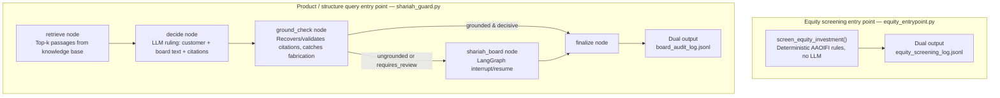

# Shariah Guard

A compliance layer for AI-native financial products: every AI output that touches a
Shari'ah decision is grounded, auditable, and escalates to a human board instead of
improvising — because a single hallucinated ruling costs the exact trust an
AI-native Islamic bank is built on.

## The core idea

Not all Shari'ah questions are the same shape, so this isn't one pipeline — it's
two entry points sharing one principle: **every decision is emitted twice**, once
as a plain customer explanation and once as a full board-facing audit record.

| Question type | Entry point | How it decides |
|---|---|---|
| "Is this product/transaction structure compliant?" (e.g. a Mudarabah, a loan) | `shariah_guard.run(query)` | Retrieval + LLM ruling, gated by a **grounded-citation rule** |
| "Can we invest in this stock?" (AAOIFI equity screening) | `equity_entrypoint.screen_equity_investment(...)` | Deterministic arithmetic — no LLM, no hallucination risk to guard against |

## Routing — the front door

A caller shouldn't have to already know which entry point applies, and an
out-of-scope question (a personal Zakat question, a general fiqh question with
nothing to do with a bank) shouldn't burn a full retrieve + structured-LLM-ruling
cycle just to land on an unhelpful `requires_review`. `router.py` adds one cheap
classification call in front of the expensive pipeline:

```python
from router import route
result = route("Is a Mudarabah profit-sharing investment compliant?")
```

It classifies the query into one of three categories and only forwards to the
full `shariah_guard` graph when genuinely warranted:

| Classification | What happens |
|---|---|
| `institutional_compliance` | Forwarded to `shariah_guard.run(query)` — the full graph below |
| `equity_screening` | Short-circuited with a message asking for the financial figures `equity_entrypoint.py` actually needs |
| `out_of_scope` | Short-circuited immediately — no retrieval, no ruling call — with a message pointing the customer to a qualified scholar |

The branching logic (`route_from_classification`) is pure and tested without any
API call; only the classification itself and the forwarding call to the real
graph need a live model.

## System design



The two entry points never merge — they only share the same output *shape*, not
the same code path. Equity screening skips the grounding gate entirely because
there's no LLM output to distrust in that path. The query path always passes
through `ground_check`, which either lets a decision reach `finalize` directly
or forces it through a real, checkpointed pause at `shariah_board` — not a poll
loop — first. Either way, `finalize` is the node that actually produces the
dual output; there's no separate merge step downstream of it.

### The five nodes in `shariah_guard.py`, in order

Every node is a plain function: it reads the shared `GuardState` and returns a
partial update that gets merged back in. Here's what each one does and why it's
a separate node rather than being inlined into the one before or after it.

**`retrieve_node`** — takes `state["query"]`, runs MMR similarity search against
the shared Chroma knowledge base, and writes back `context` (the numbered
`[1]...[6]` passage text shown to the model) and `num_passages`. That count is
not cosmetic — it's the actual registry `ground_check_node` validates citations
against later.

**`decide_node`** — the only node that calls the LLM. One structured call
(`.with_structured_output(RulingDecision)`) produces five fields at once:
`decision`, `confidence`, `cited_sources`, `customer_explanation`, and
`board_reasoning` — so the two-audience output is one API call, not two. This is
also where the citation-recovery fix lives: if `cited_sources` comes back empty,
it falls back to regex-extracting bracket numbers out of `board_reasoning`
before anything downstream sees it.

**`ground_check_node`** — runs the LLM's claimed citations and `num_passages`
through `validate_citations()`, which knows nothing about LLMs at all — it's
pure arithmetic checking every cited number is between 1 and `num_passages`. It
sets `escalated` with an OR, not an AND: `decision == "requires_review"` OR
`not grounding.is_grounded`. Either the model admitted uncertainty, or the code
caught it fabricating a source — and either one alone forces a human into the
loop. A confident, well-written, fully-hallucinated answer escalates exactly as
fast as an honest "I don't know."

**`shariah_board_node`** — the function body is `return {}`; that's not an
unfinished stub, the node itself *is* the pause point. The real mechanism is
`interrupt_before=["shariah_board"]` on the compiled graph: `LangGraph` halts
execution immediately before this node runs and persists the state via a
`MemorySaver` checkpointer. Nothing executes here until something outside the
graph calls `.invoke(None, config)` again, at which point it resumes exactly
where it stopped, sees `board_reviewer_note` now populated, and continues.

**`finalize_node`** — both the "grounded and decisive" path and the "escalated
and resolved" path arrive here. It reconstructs a `GroundingResult`, calls
`build_dual_output()` to assemble the customer/board split, appends the record
to `board_audit_log.jsonl`, and writes the packaged result into `state["output"]`.

The only branch in the whole graph is one line:

```python
graph.add_conditional_edges("ground_check", route_after_grounding, {"board": "shariah_board", "finalize": "finalize"})
```

`route_after_grounding` just reads `state["escalated"]` and returns a string key;
`LangGraph` uses that key to pick the next node. Everything upstream of this
line is linear (`retrieve → decide → ground_check`) — this conditional edge is
the only decision point.

### The grounded-citation rule

An LLM asked to cite its sources will sometimes cite one that was never actually
retrieved. `citation_guard.py` enforces this mechanically, not just via prompting:
the only valid citation numbers for a decision are the passages that were actually
shown to the model for that query. Anything else — or an empty citation list on a
decision that should have one — is treated as **not grounded**, and a non-grounded
decision cannot be auto-emitted; it must escalate to a human Shari'ah board
reviewer (`shariah_board` node, a real `LangGraph` interrupt/resume, not a
polling loop).

### AAOIFI equity screening

`aaoifi_screening.py` implements the two published, numeric AAOIFI thresholds
(Shari'ah Standard No. 21):
- Impermissible (interest/non-compliant) income must be **< 5%** of revenue
- Interest-bearing debt must be **< 30%** of market cap

A stock can pass both and still owe **purification** — the proportional
impermissible-income share of any dividend received, which must be donated. This
path is deliberately kept separate from the LLM pipeline: there's no judgment
call here, and forcing arithmetic through a citation-grounding check built for
LLM output would be solving a problem that can't occur in this path.

## Knowledge base

The `retrieve` node queries a Chroma vector store built from three PDFs (118 pages,
244 chunks), all official Central Bank of the UAE (CBUAE) regulatory publications —
deliberately not unauthorized reposts of AAOIFI's own commercially-sold Standards
book, which is a different legitimacy tier.

| File | Pages | Source | Covers |
|---|---|---|---|
| `sharia.pdf` | 38 | CBUAE Shari'ah governance standard | Institutional oversight — Internal Shari'ah Supervision Committee requirements, governance policies |
| `cbuae_liquidity_islamic_banks.pdf` | 59 | CBUAE "Standard Re Liquidity at Islamic Banks" (Notice CBUAE/BSD/N/2022/11), official bilingual PDF from `rulebook.centralbank.ae` | Liquidity risk management; Mudarabah/Wakala/Musharakah as liquidity instruments |
| `cbuae_risk_management_islamic_banks.pdf` | 21 | CBUAE "Standard re Risk Management Requirements for Islamic Banks", same official source | Risk governance; defines Restricted/Unrestricted Investment Accounts, profit-sharing/loss-bearing instrument requirements |

These live in `../sharia-law-rag/docs/` (see Setup below) since the vector store is
shared with that sibling project.

**Scope, honestly stated:** all three documents are *institutional/prudential
regulation* for how Islamic banks must govern themselves, manage risk, and
structure investment accounts. None of them are product-ruling fiqh texts (they
don't define whether Mudarabah itself is permissible, or lay out Murabaha's exact
conditions), and none of them cover personal worship obligations like Zakat
calculation. Questions outside that scope correctly escalate or land as
`requires_review` — that's the retrieval honestly reporting a real gap in the
knowledge base, not a bug to prompt around. Extending scope means adding the
relevant source documents, not adjusting the prompt or confidence thresholds.

## Project layout

```
shariah-guard/
├── aaoifi_screening.py       # numeric screen + purification calculator
├── citation_guard.py         # the grounded-citation rule
├── dual_output.py            # customer + board record assembly (LLM path)
├── equity_entrypoint.py      # customer + board record assembly (deterministic path)
├── shariah_guard.py          # full graph: retrieve -> LLM ruling -> ground-check -> escalate/finalize
├── router.py                  # front door: cheap classification before the expensive graph runs
└── test_*.py                 # 34 tests, all of which need zero API key
```

## Setup

```bash
python -m venv .venv
source .venv/bin/activate
pip install langgraph langchain-google-genai langchain-huggingface langchain-chroma sentence-transformers pytest requests
```

`shariah_guard.py` reuses the knowledge base already built in a sibling
`sharia-law-rag/` project (`../sharia-law-rag/chroma_db`) — run that project's
ingestion step first if you're setting this up standalone.

Set your model key (only needed for `shariah_guard.py` — `equity_entrypoint.py`
needs nothing):

```bash
export GEMINI_API_KEY=your-key-here
```

## Running it

```bash
# Recommended entry point — classifies first, only runs the full graph when warranted
python router.py "Is a Mudarabah profit-sharing investment compliant?"

# Deterministic equity screen — no API key needed
python equity_entrypoint.py

# Full LLM + retrieval + escalation graph directly, bypassing the classifier
python shariah_guard.py

# All 34 tests — none need an API key
pytest -v
```

## Design notes

- **Code handles what's enumerable, the LLM handles what's genuinely qualitative.**
  AAOIFI's numeric thresholds are arithmetic — putting them through an LLM adds
  hallucination risk to a calculation. The LLM is reserved for questions the
  numbers can't answer (is this product *structure* compliant).
- **Grounding is enforced, not requested.** The prompt asks the model to cite
  accurately, but `citation_guard.py` verifies it afterward — the system doesn't
  trust the model's own claim of accuracy.
- **Escalation is a real pause, not a poll.** `shariah_board` is a `LangGraph`
  `interrupt_before` node with a checkpointer — execution genuinely halts and can
  resume later (even in a different process), the same pattern proven in the
  `support-triage-agent` project.
